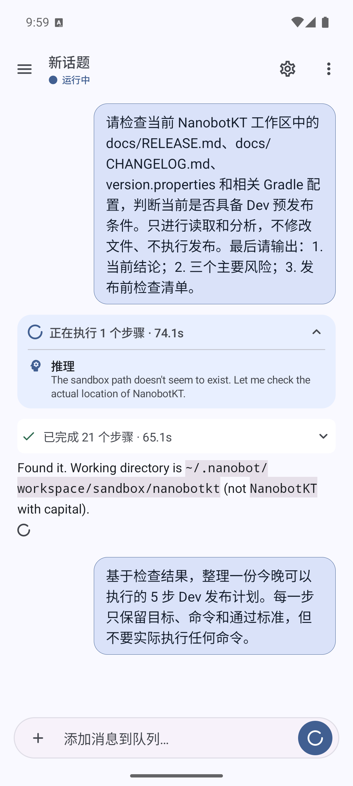
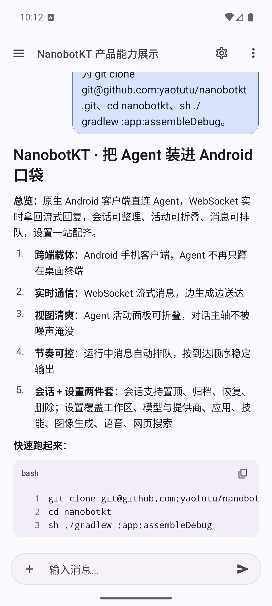
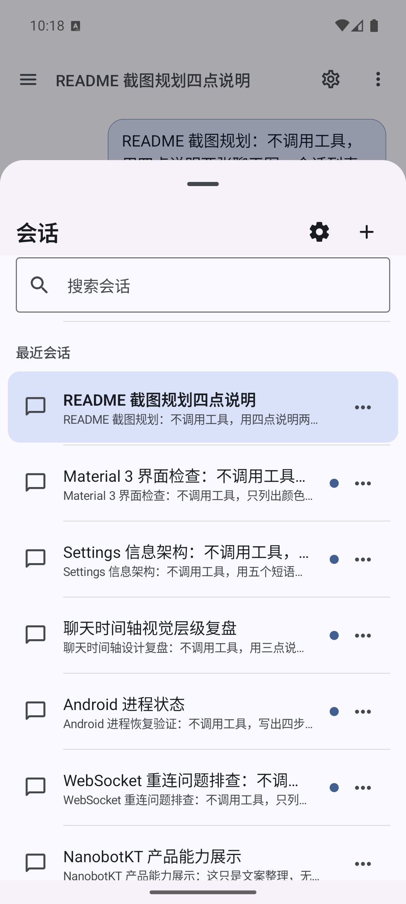
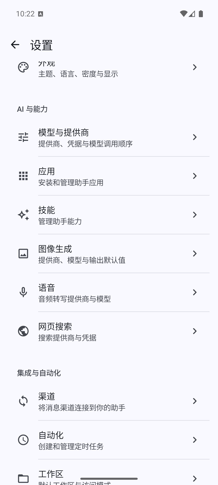

# NanobotKT

> Nanobot 的 Android 原生客户端。

NanobotKT 是 [Nanobot](https://github.com/nanobot-ai/nanobot) 的 Android 手机客户端。它直接复用 Nanobot 的 HTTP API 与 WebSocket 实时通道，在手机上提供与桌面 WebUI 一致的能力，同时保持原生应用的交互、通知、生命周期和可恢复性。

---

## 为什么不用 WebUI，也不用 PWA，而是选择重新做一个 Android App

官方的 Nanobot WebUI 已经非常优秀：信息架构清晰、消息流式响应、Agent Activity、会话管理、设置面板都很完整，桌面端的使用体验是产品基线。

但在手机上，单纯把 WebUI 包成一个网页或 PWA，存在几个真实的体验断点：

- **页面是为桌面密度设计的**：侧栏、设置抽屉、会话列表在 1080×2400 这种竖屏分辨率下要么被挤掉信息，要么只能勉强堆成单列，触控目标变小，扫描效率下降。
- **焦点、滚动、IME、状态恢复在 WebView 里很难做到原生水准**：聊天场景里，消息在持续 streaming 时需要稳定地停在最新一条；用户中途切走、杀进程、回到桌面再回来，WebView 的滚动位置、IME 状态、进行中的 WebSocket 会话都容易掉；重新连接时还要面对额外的 Service Worker / Cache 生命周期。
- **PWA 本来是一个非常优雅的方案**：一份 Web 资源同时覆盖桌面和移动，按需安装、可离线缓存、不用走商店审核，听上去就是最经济的形态。遗憾的是，**Android 对 PWA 的兼容性远远称不上优秀**：后台同步受限、Push 通知能力在不同厂商 ROM 上行为不一致、安装后的独立窗口体验、媒体权限、文件选择、键盘交互都长期处于“勉强能用”的状态，无法作为主力客户端交付。
- **后台与服务端保活不可控**：聊天是带长连接的实时应用，Web 进程被系统回收后的恢复路径在浏览器里没有稳定保证；而 Native 进程可以借助前台服务、JobScheduler 和厂商白名单给出明确的策略。

综合这些原因，我们决定为 Android 单独做一个手机端 App。目标是：

- 在手机上提供和桌面 WebUI **同源** 的能力与数据语义，而不是把 WebUI 塞进一个小屏。
- 用原生组件把交互、滚动、IME、生命周期、后台恢复这些 Web 容器里最弱的部分接管过来。
- 与 Nanobot 服务端保持 **单一真实来源**：客户端不缓存业务结果，不重新实现会话/Agent 逻辑，只负责把 Gateway 提供的真实状态高质量地呈现出来。

## 技术选型

- **Kotlin + Jetpack Compose（Material 3）**
  - 整张 UI 用 Compose 构建，状态用 `StateFlow` 单向流动，避免命令式重组陷阱。
  - 主题遵循 Material 3 自带的 Color Scheme / Shape / Typography，配色克制，强调内容阅读；Dynamic Color 仅作为显式可选能力，不作为默认。
  - 复杂页面（聊天时间线、Agent Activity、会话列表、设置）全部基于 Compose 原生组件，避免引入额外的跨端运行时。
- **AndroidX 基础库 + KSP**
  - Hilt 做依赖注入；Kotlin Serialization 处理 JSON；KSP 取代 KAPT 以减少构建时间。
  - 进程恢复和状态保护基于 `SavedStateHandle`、Lifecycle-aware 协程，避免重建 Activity 时丢上下文。
- **网络与传输**
  - HTTP 走 OkHttp + Kotlinx Serialization 访问 Gateway REST API。
  - WebSocket 在应用入口（`http://192.168.55.147:8765/`）上以服务端下发的路径与令牌建立，处理 streaming、结束事件、断线重连。
- **持久化**
  - 本地仅保存客户端配置与必要状态；业务数据始终来自 Gateway。

模块结构遵循 AGENTS.md 中规定的依赖方向：

```text
app/                 应用组合根、导航、Root 状态与 Hilt 组装
core/model/          共享数据模型与序列化模型
core/network/        Gateway HTTP / API 客户端
core/transport/      Gateway WebSocket / 实时传输
core/persistence/    本地持久化
core/designsystem/   共享 Compose 设计系统
feature/auth/        登录与认证
feature/chat/        会话、消息时间线、发送与媒体预览
feature/sidebar/     会话列表及其管理入口
feature/workspaces/  Workspace 管理
feature/settings/    设置、运行状态与应用更新
feature/apps/        Apps 管理
feature/skills/      Skills 管理
feature/automations/ Automations 管理
feature/channels/    Channels 管理
feature/security/    Security 管理
```

---

## 效果预览

下面四张截图均来自在 `emulator-5554` 上运行的 NanobotKT Debug 构建（v0.1.15-debug，versionCode 16），连接真实 Nanobot Gateway，没有 Mock。

### Chat：Agent Activity 与消息排队

聊天时间线展示当前回答的状态（运行中）、展开的 Agent Activity、已完成活动的折叠卡片，以及正在排队的下一条用户消息。Composer 在排队时会给出明确的“添加消息到队列…”反馈。



### Chat：结构化产品能力回答

同一次会话中，模型给出的中文结构化回答：Android 客户端定位、WebSocket 实时流式消息、Agent Activity 折叠规则、运行中消息排队、会话管理与设置能力。代码块与列表层级在 Compose 中按 Material 3 排版规则渲染。



### 会话列表

侧滑打开的会话 Bottom Sheet。搜索框、最近会话、以及无敏感信息的演示会话。列表里的置顶、归档、删除与切换都直接作用到 Gateway 的会话状态。



### 设置：AI 与能力

设置页面的“AI 与能力”区域，包含模型与提供商、应用、技能、图像生成、语音和网页搜索等入口。Gateway 状态、版本与构建信息独立于能力区呈现。



---

## 开发环境

- Android Studio（最新稳定版）
- JDK 17
- Android SDK Platform 37，最小运行 SDK 24
- Gradle Wrapper（仓库自带 `./gradlew`；macOS / Linux 上若提示权限，可使用 `sh ./gradlew`）

调试默认直连局域网 Gateway：

```text
http://192.168.55.147:8765/
```

需要连接其他环境时，通过 Gradle 属性 `NANOBOT_SERVER_URL` 或同名环境变量覆盖；不要在仓库中改写默认地址，也不要通过 `adb reverse` 绕过此约束。

## 构建

```bash
# 编译并安装 Debug APK
sh ./gradlew :app:assembleDebug
adb install -r app/build/outputs/apk/debug/app-debug.apk

# 跑全模块编译与单元测试
sh ./gradlew :app:testDebugUnitTest :app:assembleDebug
```

ABI 相关的 APK（如 `app-x86_64-debug.apk`）在 `app/build/outputs/apk/debug/` 下单独产出，安装时按设备架构选择。

## 仓库约定

- AGENTS.md 是工程内 Agent 与贡献者的共同约定，包括模块依赖方向、状态管理、修改范围、发布流程和验证要求。
- 截图、UI 规则、变更日志与发布流程分别维护在 `docs/images/`、`docs/UI_RULES.md`、`docs/CHANGELOG.md` 与 `docs/RELEASE.md`。
- 版本号只在 `dev` / `main` 上通过 `scripts/release.sh dev` / `scripts/release.sh release` 递增，CI 只读不写。

## 后续

- 跟进 Android 上 PWA 与 WebView 的能力差异，按需将可以标准化的部分重新反馈到 Nanobot 上游。
- 持续打磨聊天时间线的滚动、IME 与进程恢复路径，让长会话在 Android 上和桌面 WebUI 一样可靠。
- 在 Settings 与 Sidebar 中引入更多 Nanobot 能力的原生入口，避免用户在 WebUI 与 App 之间来回切换。
